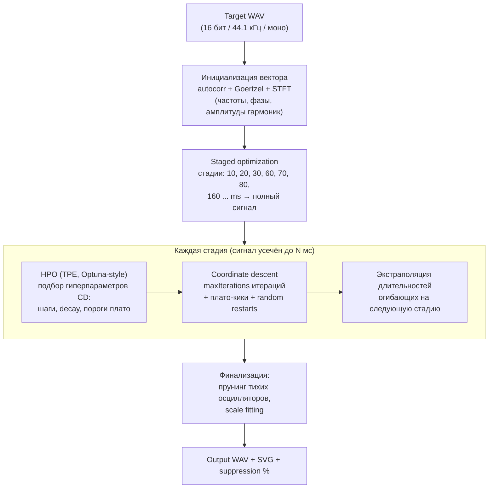
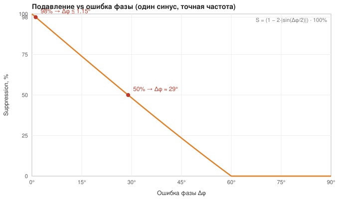
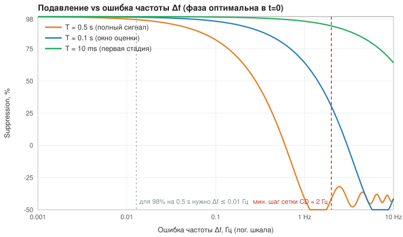
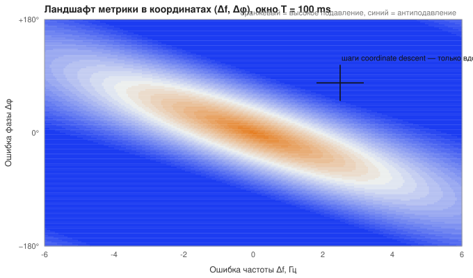

# Синтезатор

## Что это

**Synth** — генератор `.wav` файлов (44 100 Гц, 16 бит, моно) путём аддитивного синтеза. Суммирует до 50 синусоидальных осцилляторов, каждый со своей независимой огибающей частоты и амплитуды.

Также включает **пайплайн подбора параметров** к эталонным WAV-файлам (реверс-синтез): оптимизатор находит конфигурацию осцилляторов, воспроизводящую заданный звук, максимизируя RMS-based cancellation % (`suppressionPercent`). Оптимизация выполняется в worker-потоке, поддерживается асинхронный режим через job-очередь.

Веб-интерфейс (React + Vite) доступен при запуске HTTP-сервера на `http://localhost:3000`.

## Доменная модель

Эта секция описывает задачу на трёх языках — саунд-дизайнера, математика и ML-инженера — и содержит всё необходимое, чтобы понять, **почему текущий оптимизатор выходит на плато ~50% подавления** (см. [анализ ниже](#почему-подавление-застревает-около-50--анализ)).

### Задача одним абзацем

**Для саунд-дизайнера.** Берём сэмпл (WAV) и «снимаем с него патч»: подбираем настройки аддитивного синтезатора (до 50 синусоидальных осцилляторов с огибающими частоты и амплитуды) так, чтобы синтезированный звук совпал с сэмплом. Качество проверяется жёстко — как в шумоподавляющих наушниках: синтезированный сигнал инвертируется по фазе и складывается с оригиналом. Если всё подобрано идеально, они взаимно гасятся и остаётся тишина. Процент «затихания» и есть метрика качества.

**Для математика.** Дан дискретный сигнал $y \in \mathbb{R}^n$ (16-бит PCM, 44.1 кГц). Ищем параметры $\theta$ параметрической модели $\hat{y}(\theta)$ (сумма до 50 синусоид с экспоненциальными огибающими), минимизирующие $L_2$-норму остатка. Метрика:

$$
\text{suppression}(\theta) = \left(1 - \frac{\lVert y - \hat{y}(\theta) \rVert_2}{\lVert y \rVert_2}\right) \cdot 100\%
$$

100% ⇔ посэмпловое совпадение. Метрика может быть **отрицательной**, если $\hat y$ добавляет энергии вместо гашения. Это классическая задача **нелинейной аппроксимации суммой затухающих синусоид** (родственна Prony / matching pursuit / sinusoidal modeling), решаемая здесь производной-свободным покоординатным спуском.

**Для ML-инженера.** Чёрный ящик $f: [0,1]^{500} \to \mathbb{R}$ (геном из 50 осцилляторов × 10 нормализованных параметров), максимизируем derivative-free методом: staged coordinate descent + плато-кики + random restarts, с TPE-байесовской оптимизацией гиперпараметров самого спуска (Optuna-style HPO) на каждой стадии. Каждая оценка $f$ — полный ресинтез сигнала.

### Модель синтеза

Выход синтезатора в момент времени $t$ (секунды):

$$
s(t) = \operatorname{clip}_{[-1,1]}\left(\sum_{k=1}^{N} A_k(t) \cdot \sin\bigl(2\pi f_k(t)\, t + \varphi_k\bigr)\right)
$$

где для каждого осциллятора $k$:

- **Огибающая амплитуды** $A_k(t) = a_k \cdot \exp\bigl(\ln(e_k)\cdot (t/d_k)^{p_k}\bigr)$ — экспоненциальный спад от `startLevel` $a_k$ (при $t=0$) до $a_k \cdot e_k$ (при $t=d_k$); при $t > d_k$ значение замораживается. Кривизна $p_k \in [0.2, 2]$.
- **Огибающая частоты** $f_k(t) = f^{\text{base}}_k + (f^{\text{start}}_k - f^{\text{base}}_k) \cdot E_k(t)$, где $E_k(t)$ — та же экспоненциальная форма, спад от 1 до 0.001. То есть частота стартует с `freqStart` и стремится к `freqBase` (классический pitch-sweep для кик-драмов).
- $\varphi_k \in [0, 2\pi)$ — начальная фаза.

> ⚠️ Особенность модели, важная для анализа (подробно — в секции про 50%):
>
> 1. Аргумент синуса — $2\pi f(t)\,t$, а **не** интеграл $2\pi\int_0^t f(\tau)\,d\tau$. Мгновенная частота такого сигнала равна $f(t) + t f'(t)$, а не $f(t)$.

### Геном: кодирование параметров

Вектор оптимизации $x \in [0,1]^{500}$: 50 осцилляторов × 10 параметров. Денормализация — линейная (`src/vector-to-synth-config.ts`, единственный источник истины):

| Offset | Параметр           | Диапазон      | Примечание                                                           |
| ------ | ------------------ | ------------- | -------------------------------------------------------------------- |
| 0      | `on`               | {0, 1}        | Бинарный флаг (порог 0.5)                                            |
| 1      | `freqBase`         | 20–20 000 Гц  | Линейная шкала: 1 ед. вектора = 19 980 Гц                            |
| 2      | `freqStart`        | 20–20 000 Гц  | То же                                                                |
| 3      | `slope` (freq env) | 0.2–2         | Кривизна огибающей частоты                                           |
| 4      | `duration` (freq)  | 1/44100–0.5 с |                                                                      |
| 5      | `phase`            | 0–2π          | Без wrap-around: шаги клампятся на границах 0 и 1                    |
| 6      | `duration` (amp)   | 1/44100–0.5 с |                                                                      |
| 7      | `endLevel`         | 0.001–1       |                                                                      |
| 8      | `slope` (amp env)  | 0.2–2         |                                                                      |
| 9      | `startLevel`       | 0.001–1       | Масштаб огибающей амплитуды при $t=0$                       |

### Целевая метрика и surrogate-объектив

Итоговая метрика (`src/cancellation-assessment.ts`):

$$
\text{suppression} = \left(1 - \frac{\operatorname{RMS}(y + \hat{y}_{\text{inv}})}{\operatorname{RMS}(y)}\right)\cdot 100\%, \qquad \hat{y}_{\text{inv}} = -\hat{y}
$$

Обратите внимание: шкала — по **RMS (амплитуде)**, а не по энергии. 50% подавления ⇔ остаточная RMS = половина исходной ⇔ подавлено 75% **энергии**.

Однако внутри coordinate descent оптимизируется не она, а **композитный surrogate** (`evaluateSuppressionWindowed`, `src/optimize/evaluate.ts`):

$$
J = 0.7 \cdot \overline{S}_{\text{win}} + 0.3 \cdot S_{\text{spec}} - 0.5\cdot \max(0,\, S_{\text{glob}} - \overline{S}_{\text{win}})
$$

- $\overline{S}_{\text{win}}$ — средний suppression по 100-мс окнам, причём **в каждом окне независимо подбирается лучший скаляр громкости** из дискретного списка (24 кандидата 0.05–3.0); окна с `targetRMS < 1` (в 16-бит единицах) пропускаются;
- $S_{\text{spec}}$ — спектральное совпадение магнитуд (Goertzel) на 5 доминантных частотах таргета;
- последний член — штраф за «нечестную» форму (глобальный скейл лучше среднего локального).

Число на графиках прогресса и в job-статусах — именно $J$, а не «чистый» suppression.

### Пайплайн подбора



Один шаг coordinate descent: для каждого включённого осциллятора и каждого из 9 непрерывных параметров пробуются два кандидата $x_i \pm \text{step}$ (для «громкости» — мультипликативно $x_i(1\pm\text{step})$); каждый кандидат = полный ресинтез + вычисление $J$. Итого на итерацию при 30 активных осцилляторах: $30 \times 9 \times 2 = 540$ полных оценок $f$.

## Почему подавление застревает около 50% — анализ

Секция для математика / DS, который хочет помочь довести подавление до ~100%. Все числа ниже воспроизводимы аналитически (формулы приведены) и проверены скриптами на этом коде.

### 1. Метрика беспощадна к ошибкам фазы и частоты

Для одиночного синуса с точной частотой и ошибкой фазы $\Delta\varphi$:

$$
S = \bigl(1 - 2\,\lvert\sin(\Delta\varphi/2)\rvert\bigr)\cdot 100\%
$$

- **98%** требует $\Delta\varphi \le 1.15°$;
- **50%** — это всего лишь $\Delta\varphi \approx 29°$.



Для ошибки частоты $\Delta f$ на длительности $T$ (фаза оптимальна в $t=0$): средняя корреляция $M = \frac{\sin(2\pi\Delta f T)}{2\pi\Delta f T}$, $S = (1-\sqrt{2-2M})\cdot100\%$. На полном сигнале $T=0.5$ с:

| $\Delta f$ | Suppression |
| ---------- | ----------- |
| 0.01 Гц    | 98.2%       |
| 0.02 Гц    | 96.4%       |
| 0.1 Гц     | 81.9%       |
| 2 Гц       | **−41.4%**  |



**Интерпретация плато 47%:** это уровень «доминантная часть энергии погашена с фазовой ошибкой ~30° или частотной ~0.5 Гц». Т.е. оптимизатор находит правильные частоты грубо, но не может дожать точность.

### 2. Линейная нормализация частоты и шаг спуска

Частота кодируется линейно: $[0,1] \mapsto [20, 20000]$ Гц (1 ед. вектора ≈ 19 980 Гц). Это по-прежнему жёсткий потолок: один и тот же шаг в герцах на 20 Гц и на 20 кГц, лог-шкала не введена.

Шаг по частоте **больше не общий** с остальными параметрами. Coordinate descent использует двухскоростной абсолютный шаг (offsets 1–2):

| Цикл | Параметр | Шаг в векторе | ≈ Гц |
| ---- | -------- | ------------- | ---- |
| EXPLORATION / REFINEMENT | `frequencyStepCoarse` | $10^{-4}$ | **2 Гц** |
| PRECISION | `frequencyStep` | $10^{-7}$ | **0.002 Гц** |

Мелкий шаг достаточен, чтобы в изоляции дожать частоту до уровня 98% из таблицы выше (~0.01 Гц). Грубый шаг нужен, чтобы вообще дойти до главного лепестка: раньше единый `minStep` цикла ($10^{-2}\ldots10^{-4}$) либо перекрывал мелкий шаг (~200…2 Гц), либо — после отвязки — оставлял только микрошаг, которым нельзя пройти даже 1 Гц.

Фаза уже имеет отдельный шаг `phaseStep` ≈ 1.1°. Оставшийся потолок п. 2 — линейная (не логарифмическая) параметризация, а не отсутствие per-class шага.

### 3. Ландшафт — узкие диагональные гребни, а CD шагает по осям

Область высокого $J$ в координатах (частота, фаза) — узкий изогнутый гребень: ошибку частоты можно частично компенсировать фазой (и наоборот), но покоординатные шаги «частота отдельно, фаза отдельно» почти всегда выпадают с гребня и отвергаются. Классический режим отказа axis-aligned методов:



Кроме того, $J$ как функция частоты осциллирует (боковые лепестки sinc) — множество локальных максимумов с периодом $\sim 1/T$ Гц; плато-кики со случайной величиной параметра редко попадают в главный лепесток шириной 0.01 Гц.

### 4. ~~Баг~~: параметр «громкости» теперь работает

`envelopeCreator` (`src/envelope.ts`) **игнорировал** поле `max`, в которое синтезатор передаёт `ampEnv.startLevel`. Это было исправлено: формула теперь `max * (e ^ (ln(min) * (x/duration)^slope))`.

**До исправления:**
- у модели **не было индивидуальной громкости осциллятора** — каждый активный партиал стартовал с амплитуды 1.0;
- оптимизатор тратил ходы на offset 9 (2 полных ресинтеза на осциллятор за итерацию) — бесполезно;
- **финальный scale fitting — no-op**: `findOptimalScale` записывал score, но умножал мёртвый параметр;
- прунинг и `enforceFlagInvariant` принимали решения по мёртвому параметру.

**После исправления:** `startLevel` масштабирует амплитуду огибающей. Осцилляторы теперь имеют реальную громкость, scale fitting пишет множитель в геном и **переоценивает пересинтезированный** сигнал (а не score с отмасштабированного waveform), а клиппинг (п. 5) должен уменьшиться.

### 5. Жёсткий клиппинг суммы

`createSynth` клампит сумму в $[-1, 1]$. До исправления п. 4 все $N$ активных осцилляторов стартовали с амплитуды 1.0, поэтому при $N \gg 1$ сигнал в начале почти гарантированно клиппился. После починки `startLevel` оптимизатор может уменьшить начальные амплитуды гармоник, но риск клиппинга сохраняется если `startLevel` в сумме даёт > 1.

### 6. Фазовая модель без интеграла частоты

Осциллятор вычисляет $\sin(2\pi f(t)\,t + \varphi)$. Мгновенная частота такого сигнала — $f(t) + t\,f'(t)$, а не $f(t)$. Пример (проверено подсчётом нулевых пересечений): sweep 2000→100 Гц, в точке $t=0.4$ с огибающая даёт $f(t) \approx 107$ Гц, а реально звучит ~50–65 Гц. Следствия: «freqBase» не равен звучащей частоте нигде, кроме асимптотики; при изменении `duration`/`slope` огибающей частоты **фаза всего хвоста сигнала сдвигается** — параметры перестают быть локальными, каждый шаг по одному параметру портит согласование остальных.

### 7. Рассогласование surrogate-объектива и целевой метрики

- Per-window свободный скаляр громкости внутри $J$ разрешает то, что раньше геном воспроизвести не мог (loudness был недоступен — см. п. 4); теперь, с рабочим `startLevel`, per-window скейл может рассогласовывать $J$ и реальное подавление;
- дискретная сетка скейлов (0.05–3.0) добавляет ступеньки в ландшафт;
- фаза не имеет wrap-around: около $\varphi = 0$/$2\pi$ спуск упирается в границу куба, хотя оптимум рядом «с другой стороны»;
- ранний выход настроен на 98 — недостижимо в текущей конфигурации, не влияет.

### 8. Стоимость одной оценки $f$ ограничивает бюджет итераций

Каждая оценка кандидата: полный ресинтез ($n \times N$ вызовов $\sin$) + per-window перебор 24 скейлов + спектральный скор. При этом `computeSpectralScore` на **каждую оценку** заново ищет доминантные частоты _таргета_ Goertzel-сканом 20–5000 Гц с шагом 5 Гц (~1000 проходов по $O(n)$) — хотя таргет неизменен. При 540 оценках на итерацию это главный пожиратель времени: часами работающие джобы успевают сделать лишь десятки итераций CD, которых на 500-мерном ландшафте заведомо мало.

### Что даст наибольший прирост (по убыванию ожидаемого эффекта)

1. ~~**Починить громкость** (п. 4)~~ — ✅ **выполнено**. `max` в `envelopeCreator` теперь используется как масштаб огибающей. Scale fitting, прунинг, клиппинг — все работают с реальным параметром.
2. **Сменить параметризацию частоты** (п. 2): лог-шкала (20 Гц–20 кГц ≈ 10 октав; полутоновая/центовая сетка естественна и для музыкального слуха). ~~Отдельные масштабы шага на класс параметра~~ — ✅ **сделано** (двухскоростной шаг частоты + отдельный шаг фазы).
3. **Разделить задачу на линейную и нелинейную части** (классический приём — variable projection / VARPRO): при фиксированных частотах и огибающих модель **линейна по амплитудам и фазам** ($a\sin + b\cos$). Амплитуды/фазы всех осцилляторов находятся точно и мгновенно решением МНК, поиск остаётся только по частотам. Это убирает из чёрного ящика 3 из 9 координат и ровно те, к которым метрика наиболее чувствительна. Родственные готовые методы: sinusoidal modeling (McAulay–Quaternieri), matching pursuit по остатку, Prony/ESPRIT для оценки частот затухающих синусоид.
4. **Точная доводка частот 1-D методами**: после грубого попадания — параболическая интерполяция / золотое сечение по одной частоте с аналитически оптимальной фазой (см. п. 3), вместо фиксированной сетки шагов.
5. **Согласовать объектив** (п. 7): убрать per-window скейл, когда появилась настоящая громкость; добавить wrap-around фазы; кешировать спектральный анализ таргета (п. 8 — бесплатное ускорение на порядок).
6. **Заменить фазовую модель на интеграл частоты** $\sin(2\pi\int_0^t f \, d\tau + \varphi)$ (п. 6) — параметры огибающей частоты станут локальными по эффекту.
7. Если оставаться в derivative-free парадигме — CMA-ES или Powell вместо покоординатного спуска (устойчивы к гребням), но пп. 2–4 дают больше при меньших затратах.

> Графики в `docs/img/` сгенерированы аналитически по формулам из этой секции; числовые утверждения о поведении кода (реальная мгновенная частота, исправленный `startLevel`) проверены прямыми экспериментами на модулях `src/synth.ts` / `src/envelope.ts`.

## Установка

```bash
npm install
```

## Функциональности

### 1. Генерация WAV из пресета

Создаёт WAV-файл из конфигурации осцилляторов, описанной в `src/presets.ts`.

```bash
# Без сборки
npm run dev

# С сборкой
npm run build && npm run start
```

Результат: `output15.wav`. Имя файла настраивается в `src/index.ts`.

#### Как настроить звук

Откройте `src/presets.ts`. Каждый осциллятор имеет:

| Параметр            | Описание                                         |
| ------------------- | ------------------------------------------------ |
| `freqBase`          | Базовая частота (Гц), к которой стремится сигнал |
| `freqStart`         | Начальная частота (Гц) при t = 0                 |
| `duration`          | Длительность огибающей (с)                       |
| `slope`             | Кривизна огибающей                               |
| `phase`             | Начальная фаза (рад), от 0 до 2π                 |
| `ampEnv.startLevel` | Начальный уровень амплитуды                      |
| `ampEnv.endLevel`   | Конечный уровень амплитуды                       |
| `ampEnv.duration`   | Длительность огибающей амплитуды (с)             |
| `ampEnv.slope`      | Кривизна огибающей амплитуды                     |

```ts
import { MIN } from './envelope';

export const synthPreset1 = {
  oscillators: [
    {
      osc: {
        freqBase: 440,
        freqStart: 880,
        duration: 0.5,
        slope: 0.8,
        phase: 0,
        on: true,
      },
      ampEnv: {
        startLevel: 0.5,
        endLevel: MIN,
        duration: 0.5,
        slope: 0.8,
      },
    },
  ],
};
```

### 2. Визуализация огибающих

Создаёт SVG-графики огибающих амплитуды и частоты для первого осциллятора из пресета `src/presets.ts`.

```bash
npm run viz
```

Результат: файлы `envelope-amplitude.svg` и `envelope-frequency.svg`.

Чтобы изменить визуализируемый пресет, отредактируйте `src/visualize-envelopes.ts` (строка `synthPreset1`).

### 3. Подбор параметров к WAV

Анализирует целевой WAV-файл, оптимизирует конфигурацию осцилляторов (чистый coordinate descent) и создаёт воссозданный WAV + визуализацию сравнения. Оптимизация выполняется в отдельном worker-потоке (`optimizer-worker.ts`), чтобы не блокировать основной поток.

```bash
# Запуск
npm run dev src/match-entry
```

Результат:

- `output14_reacreation.wav` — сгенерированный файл
- `output14_reacreation.wav-match.svg` — график сравнения сигналов + прогресс оптимизации

#### Как настроить подбор

Откройте `src/match-entry.ts`:

```ts
match({
  targetWavPath: './your-file.wav', // Целевой WAV
  outputWavPath: './matched-output.wav', // Выходной WAV
  maxIterations: 2000, // Макс. итераций (по умолчанию 100)
  initialVector: mapSynthConfigToVector(
    // Начальная точка (опционально)
    SYNTH_MULTI_PRESET(5),
  ),
  onProgress: (entry) => {
    // Коллбек прогресса (опционально)
    console.log(
      `Iteration ${entry.iteration}: ${entry.suppressionPercent.toFixed(2)}%`,
    );
  },
});
```

#### Алгоритм оптимизации

По умолчанию используется **поэтапная оптимизация со встроенным HPO**: сигнал
разбивается на нарастающие стадии (от 10ms до полной длины), перед каждым
CD-этапом HPO на коротком сигнале подбирает оптимальные гиперпараметры.

| Особенность        | Описание                                                                                 |
| ------------------ | ---------------------------------------------------------------------------------------- |
| Поэтапный рост     | `10ms → 30ms → 50ms → ... → full signal` (множитель ≥2.0, ±10ms)                         |
| HPO на стадии      | 2 trials × 7 CD-итераций подбора гиперпараметров (TPE-сэмплер)                           |
| Координатный спуск | После HPO запускается полный CD (`maxIterations`, дефолт 100) с лучшими гиперпараметрами |
| Экстраполяция      | После каждой стадии длительности осцилляторов экстраполируются                           |
| Phase в UI         | `phase: 'hpo'` (красные точки) и `phase: 'cd'` (синяя линия) на графике прогресса        |

Внутри каждого координатного спуска:

| Особенность            | Описание                                                                                           |
| ---------------------- | -------------------------------------------------------------------------------------------------- |
| Циклы оптимизации      | Три фазы: `EXPLORATION` (шаг 0.025→0.01) → `REFINEMENT` (0.01→0.003) → `PRECISION` (0.0025→0.0001) |
| Плато-пинки            | При `3` итерациях без улучшения — случайное изменение одного параметра                             |
| Random restart         | После `5` пинков — полный рандомный перезапуск генома                                              |
| Затухание шага         | При `4` итерациях без улучшения шаг умножается на `0.9`                                            |
| `on` параметр          | Строго бинарный (`0` или `1`); при `on = 0` параметры `1-9` осциллятора пропускаются               |
| `enforceFlagInvariant` | Гарантирует, что осцилляторы с `volume > VOLUME_MIN` включены; все до rightmostEnabled — тоже      |
| Оконечная оценка       | `evaluateSuppressionWindowed` — score по 100ms окнам + спектральный scoring (Goertzel) + penalty   |
| Scale fitting          | После оптимизации подбирается оптимальный масштаб громкости                                        |
| Финальный прунинг      | Осцилляторы с `startLevel < VOLUME_PRUNE_THRESHOLD` последовательно отключаются                    |
| Ранний выход           | Достижение `98%` suppression или окончание всех циклов                                             |

> **Важно:** оптимизация вычислительно затратна. Каждая оценка параметра пересинтезирует полный сигнал. Windowed-evaluation оценивает качество по коротким окнам (100ms) с оптимальным scale + спектральным score через Goertzel-алгоритм.

#### Инициализация вектора

Для подбора параметров доступны стратегии создания начального вектора:

| Файл                          | Описание                                                                                                                                                     |
| ----------------------------- | ------------------------------------------------------------------------------------------------------------------------------------------------------------ |
| `src/simple-init-vector.ts`   | Goertzel-анализ + STFT-гармоники. Определяет sweep (freqOverTime + amplitude envelope), извлекает фазы/амплитуды через Goertzel, дополняет STFT-траекториями |
| `src/fft-init-vector.ts`      | FFT на коротком окне (~23ms) — детекция доминантных гармоник для инициализации частот, фаз и амплитуд                                                        |
| `src/stft-init-vector.ts`     | STFT-анализ + кластеризация гармоник + fit envelope. Авто-фундаментальная частота через автокорреляцию, amplitude envelope через RMS-окна                    |
| `src/adaptive-init-vector.ts` | Адаптивная инициализация: определяет биения (amplitude modulation), разбивает фундаментальный тон на два близких, добавляет STFT-гармоники                   |

Вспомогательные модули анализа сигналов:

| Файл                     | Назначение                                                                                                 |
| ------------------------ | ---------------------------------------------------------------------------------------------------------- |
| `src/signal-analysis.ts` | Автокорреляция (фундаментальная частота), amplitude envelope (RMS-окна), freqOverTime (zero-crossing rate) |
| `src/spectrogram.ts`     | STFT-анализ: Hanning window, FFT, peak detection, кластеризация гармоник в траектории, fit osc envelopes   |
| `src/fft.ts`             | Cooley-Tukey radix-2 FFT, extraction доминантных гармоник с bias к фундаментальным частотам                |

### 4. Веб-интерфейс

React-приложение (Feature-Sliced Design) для генерации WAV и подбора параметров через браузер.

```bash
# Из корня — dev-сервер (Vite) с прокси на бэкенд:3000
cd web && npm install
cd web && npm run dev    # http://localhost:5173

# Production build
cd web && npm run build  # → web/dist/
```

Функциональность:

- **Synth Generator** — генерация WAV из пресета или ручной настройки осцилляторов
- **WAV Matcher** — загрузка WAV-файла и запуск подбора параметров (асинхронный режим через job API)
- Настройка duration и sampleRate
- Прослушивание результата в браузере
- Скачивание сгенерированного `.wav`

Дизайн-система: тёмная инженерная тема (Ableton-стиль)
с CSS custom properties (`web/src/global.css`). Корневые цвета
`#121212` / `#1e1e1e`, акцент `#e67e22`, шрифты Inter + JetBrains Mono,
компактная плотная компоновка.

### 5. Форматирование и линтинг

```bash
npm run prettier       # Prettier (авто)
npm run prettier:check # Prettier (проверка)
npm run lint           # ESLint (проверка)
npm run lint:fix       # ESLint (автофикс)
```

## Технологии

- Node.js
- TypeScript
- Express (HTTP-сервер, API)
- Worker Threads (фоновая оптимизация)
- React + Vite (веб-интерфейс)
- tsx (dev-рантайм)
- Prettier + ESLint

## Как работает огибающая

`E = a_max * e^(ln(a_min) * (t / t_end)^slope)`

| Переменная | Описание                                            |
| ---------- | --------------------------------------------------- |
| `a_max`    | Начальный уровень огибающей (`ampEnv.startLevel`)   |
| `a_min`    | Множитель конечного уровня (`endLevel`, `0.001–1`)  |
| `t`        | Текущий момент времени (с)                          |
| `t_end`    | Желаемая продолжительность огибающей (с)            |
| `slope`    | Кривизна                                            |
| `E`        | Амплитуда при `t`, масштабированная от `a_max` вниз |

Когда `t > t_end`, время clamp'ится к `t_end` — огибающая остаётся на последнем вычисленном уровне. Частота и громкость осциллятора продолжают использовать это финальное значение до окончания генерации.

## Структура проекта

| Файл / Папка                        | Назначение                                                                                                                                                                                    |
| ----------------------------------- | --------------------------------------------------------------------------------------------------------------------------------------------------------------------------------------------- |
| `src/index.ts`                      | Генерация WAV из `presets.ts`                                                                                                                                                                 |
| `src/server.ts`                     | Точка входа HTTP-сервера                                                                                                                                                                      |
| `src/api/`                          | Express API (контроллеры, роуты, сервисы)                                                                                                                                                     |
| `src/presets.ts`                    | Пресеты для генерации                                                                                                                                                                         |
| `src/match-entry.ts`                | Точка входа подбора параметров                                                                                                                                                                |
| `src/match.ts`                      | Оркестратор: read → optimize → generate → visualize                                                                                                                                           |
| `src/match-worker.ts`               | Обёртка для запуска оптимизации в worker-потоке                                                                                                                                               |
| `src/optimizer-worker.ts`           | Реализация worker-потока для оптимизации                                                                                                                                                      |
| `src/match-preset.ts`               | Пресеты для начальной точки оптимизации                                                                                                                                                       |
| `src/match-visualize.ts`            | SVG сравнения сигналов + прогресс                                                                                                                                                             |
| `src/optimize/`                     | Модуль оптимизации: `index.ts` (реэкспорт), `coordinate-descent.ts` (алгоритм), `evaluate.ts` (оценка), `consts.ts` (константы), `types.ts` (типы), `staged.ts` (поэтапная оптимизация с HPO) |
| `src/optimize/hpo/`                 | Hyperparameter optimization: `run-hpo.ts` (координатор), `study.ts`, `trial.ts`, `sampler.ts`, `sampler-tpe.ts` (TPE), `param-space.ts`                                                       |
| `src/signal-analysis.ts`            | Анализ сигналов: автокорреляция, amplitude envelope, freqOverTime                                                                                                                             |
| `src/spectrogram.ts`                | STFT-анализ: Hanning window, FFT, peak detection, кластеризация, fit envelopes                                                                                                                |
| `src/fft.ts`                        | Cooley-Tukey radix-2 FFT, extraction доминантных гармоник                                                                                                                                     |
| `src/simple-init-vector.ts`         | Инициализация: Goertzel + STFT-гармоники                                                                                                                                                      |
| `src/fft-init-vector.ts`            | FFT-инициализация на коротком окне (~23ms)                                                                                                                                                    |
| `src/stft-init-vector.ts`           | STFT-инициализация с траекториями                                                                                                                                                             |
| `src/adaptive-init-vector.ts`       | Адаптивная инициализация: детекция биений через amplitude modulation                                                                                                                          |
| `src/visualize-envelopes.ts`        | Генерация SVG огибающих                                                                                                                                                                       |
| `src/visualize.ts`                  | Утилита для построения SVG-графиков                                                                                                                                                           |
| `src/synth.ts`                      | Создатель синтезатора                                                                                                                                                                         |
| `src/oscillator.ts`                 | Расчёт сигнала осциллятора                                                                                                                                                                    |
| `src/envelope.ts`                   | Экспоненциальная функция огибающей                                                                                                                                                            |
| `src/read-wav.ts`                   | Парсинг 16-бит WAV                                                                                                                                                                            |
| `src/write-wav.ts`                  | Запись WAV                                                                                                                                                                                    |
| `src/cancellation-assessment.ts`    | Оценка качества подавления (RMS)                                                                                                                                                              |
| `src/rms.ts`                        | Расчёт RMS энергии                                                                                                                                                                            |
| `src/synth-config-to-vector.ts`     | Нормализация конфига → `[0,1]`                                                                                                                                                                |
| `src/vector-to-synth-config.ts`     | Денормализация вектора → конфиг (50 осцилляторов)                                                                                                                                             |
| `src/consts.ts`                     | Константы: `SAMPLE_RATE`, `VOLUME_MIN`, `VOLUME_PRUNE_THRESHOLD`                                                                                                                              |
| `web/`                              | Веб-интерфейс (React + Vite, FSD)                                                                                                                                                             |
| `web/src/global.css`                | Дизайн-система: токены, тёмная тема, шрифты (CSS custom properties)                                                                                                                           |
| `web/src/app/`                      | Инициализация приложения, корневой лейаут                                                                                                                                                     |
| `web/src/features/synth-generator/` | Фича генерации WAV                                                                                                                                                                            |
| `web/src/features/wav-matcher/`     | Фича подбора параметров к WAV                                                                                                                                                                 |
| `web/src/shared/ui/`                | Переиспользуемые UI-компоненты: `Button`, `Input`, `Select`, `AudioPlayer`                                                                                                                    |
| `web/src/shared/api/`               | Базовый HTTP-клиент (`fetchApi`, `fetchBlob`)                                                                                                                                                 |

**Соглашения**

### TypeScript (`tsconfig.json`)

- `strict: true`
- `verbatimModuleSyntax: false`
- `noUncheckedIndexedAccess: true`
- `exactOptionalPropertyTypes: false`

### Prettier (`.prettierrc`)

- `semi: true`
- `singleQuote: true`
- `trailingComma: "all"`
- `printWidth: 70`
- `tabWidth: 2`

**HTTP API эндпоинты**

#### Генерация и синхронный мэтчинг

| Метод  | Путь                | Описание                                                                                    |
| ------ | ------------------- | ------------------------------------------------------------------------------------------- |
| `GET`  | `/health`           | Health check                                                                                |
| `GET`  | `/presets`          | Список доступных пресетов                                                                   |
| `POST` | `/api/generate`     | Генерация WAV (JSON: `preset` или `oscillators`) → WAV binary                               |
| `POST` | `/api/match`        | Подбор параметров (JSON: `wavBase64`) → JSON с `wavBase64`, `history`, `suppressionPercent` |
| `POST` | `/api/match/binary` | Подбор параметров (raw `audio/wav`) → WAV binary                                            |

#### Асинхронный мэтчинг (job‑очередь)

| Метод    | Путь                                  | Описание                                        |
| -------- | ------------------------------------- | ----------------------------------------------- |
| `POST`   | `/api/match/job`                      | Создать job подбора (base64 WAV) → `{ id }`     |
| `POST`   | `/api/match/job/json`                 | Создать job подбора (raw WAV binary) → `{ id }` |
| `GET`    | `/api/match/jobs`                     | Список всех job                                 |
| `GET`    | `/api/match/jobs/:id`                 | Статус конкретного job                          |
| `GET`    | `/api/match/jobs/:id/download`        | Скачать результат WAV (completed job)           |
| `GET`    | `/api/match/jobs/:id/download-params` | Скачать параметры подбора JSON (completed job)  |
| `DELETE` | `/api/match/jobs/:id`                 | Удалить job и связанные файлы                   |

**Важные детали**

### Асимметрия маппинга

`mapSynthConfigToVector()` возвращает `10 * N` значений (N — число осцилляторов). `mapVectorToSynthConfig()` всегда создаёт 50 осцилляторов. Round‑trip расширяет 2‑осцилляторный пресет до 50 (оставшиеся `on: false`).

### Производительность оптимизации

По умолчанию: поэтапная оптимизация со встроенным HPO. Сигнал разбивается
на нарастающие стадии (10ms → ... → full, множитель ≥2), HPO (2 trials × 7 iter)
подбирает гиперпараметры перед каждым CD-этапом. После HPO CD запускается
на пользовательские `maxIterations` (дефолт 100).

Coordinate descent использует мульти-цикловый подход (EXPLORATION → REFINEMENT → PRECISION).
На каждой итерации последовательно оптимизируется каждая координата активного
осциллятора. Параметр `on` строго бинарный (`0` или `1`); отключённые осцилляторы
пропускаются. Оценка через `evaluateSuppressionWindowed`: средний score по 100ms
окнам + оптимальный scale + спектральный score (Goertzel на доминантных частотах) +
shape penalty. Плато-пинки и random restarts для выхода из локальных оптимумов.
Финальный scale fitting и прунинг тихих осцилляторов.

### Worker‑потоки

Оптимизация выполняется в отдельном worker‑потоке (`optimizer‑worker.ts`) через `worker_threads`. `match‑worker.ts` предоставляет промис‑обёртку для удобного вызова. Таймаутов нет — остановка только по `maxIterations` или ошибке.

### Устойчивость к сбоям

Все побочные I/O на горячем пути (прогресс‑репорты, запись статуса, логирование) оборачиваются в `try/catch` — ошибка не‑критичной операции не роняет процесс. Файлы пишутся атомарно через `.tmp` → `rename()`, при повреждении или отсутствии job‑файла создаётся fallback‑record.
